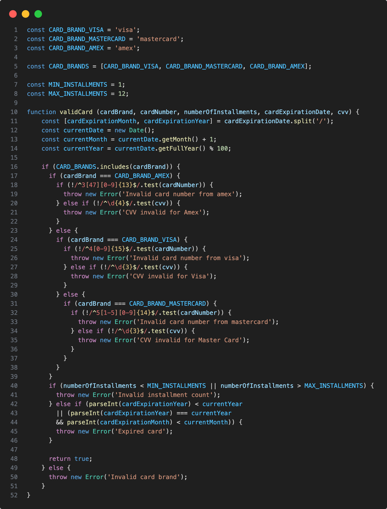
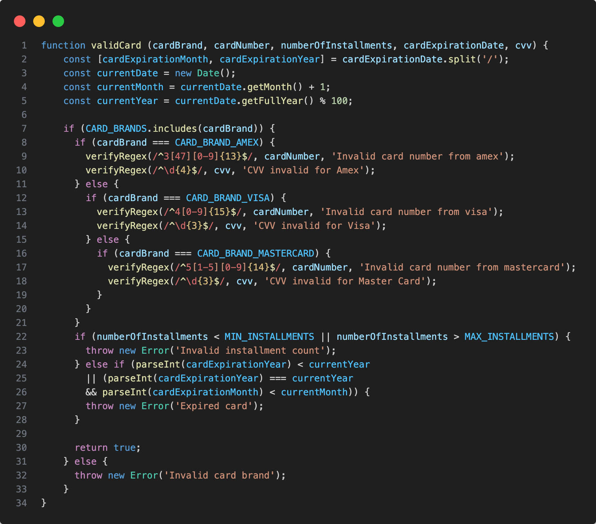

# Princípios de design de código

Os princípios de design de código são diretrizes e boas práticas que as desenvolvedoras seguem ao escrever software para garantir que o código seja legível, sustentável, escalável e de fácil manutenção.

## DRY (Don't Repeat Yourself)

O princípio DRY (Don't Repeat Yourself) é uma filosofia de design de software que promove a eliminação de duplicação de código. Ele sugere que cada parte do sistema deve ter uma única representação autoritativa, e qualquer duplicação deve ser removida. Isso reduz a redundância no código, facilitando sua manutenção e evolução.

### Antes de aplicar DRY

Duplicação do trecho de verificar regex:

### Depois de aplicar DRY

Extraindo o trecho de código duplicado para dentro da função `verifyRegex` e reutilizando-a:

### Benefícios do Princípio DRY:

1. **Manutenibilidade:** Quando a lógica está centralizada em um único lugar, fazer alterações ou correções se torna mais simples, porque você só precisa alterar um ponto no código.

2. **Legibilidade:** Código sem duplicações é mais limpo e mais fácil de entender. Repetições podem tornar o código confuso e difícil de seguir.

3. **Redução de Erros:** A duplicação aumenta a probabilidade de erros, pois pode ser fácil esquecer de atualizar todas as cópias do código duplicado. Seguir o DRY ajuda a evitar inconsistências.

## SOLID
